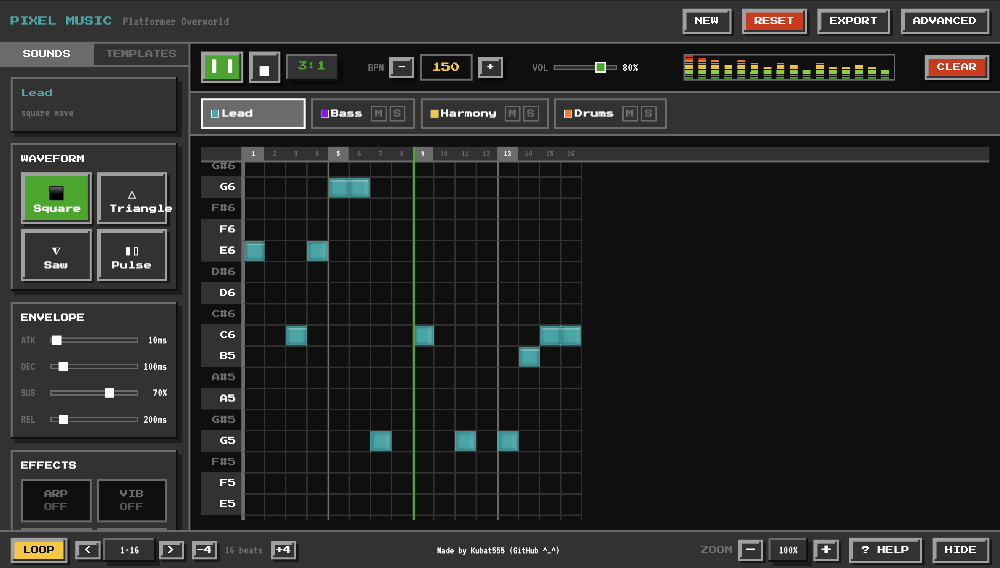
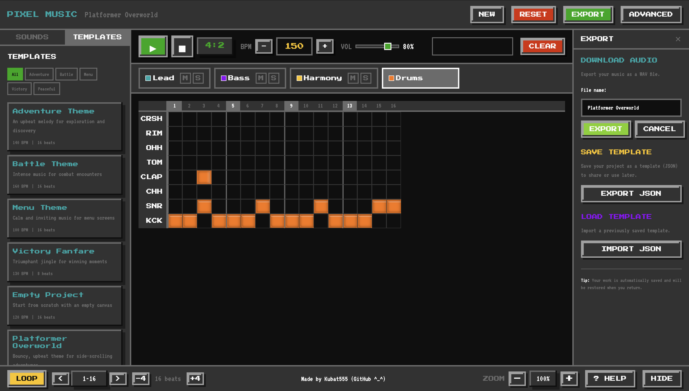

# Pixel Game Music Generator

A browser-based 8-bit chiptune music creator for pixel-art games. Create retro game soundtracks with no music experience required!


## Features

### Audio Engine
- **Classic Waveforms**: Square, Triangle, Sawtooth, Pulse, and Noise
- **ADSR Envelopes**: Attack, Decay, Sustain, Release controls
- **Audio Effects**: Arpeggiator, Vibrato, Glide, Bitcrusher
- **Precise Timing**: Look-ahead scheduler for game-loop quality audio
- **8 Drum Sounds**: Kick, Snare, Hi-Hat (closed/open), Clap, Tom, Crash, Rimshot

### Sequencer
- **4-Track System**: Lead, Bass, Harmony, and Drums
- **Piano Roll Grid**: Click to add notes, visual feedback
- **Full Note Range**: 7 octaves (C1-B7) for melodic tracks
- **Variable Note Duration**: Drag to resize notes
- **Loop Controls**: Adjustable loop region with zoom
- **Real-time Playback**: Hear changes instantly
- **Audio Visualizer**: Real-time frequency bars display

### Editing Features
- **Copy/Cut/Paste**: Standard clipboard operations for notes
- **Undo/Redo**: Full history with up to 50 states
- **Select All**: Quick selection of all notes in track
- **Duplicate**: Clone selected notes with offset
- **Multi-select**: Select multiple notes for batch operations

### Export & Import
- **WAV Export**: Download your music as WAV audio file with custom filename
- **JSON Templates**: Save and load projects as JSON files
- **Template Naming**: Name your templates before saving
- **Progress Indicator**: Visual progress bar during audio rendering

### User Experience
- **Beginner Mode**: Simplified controls for newcomers
- **Advanced Mode**: Full synthesis and effect controls
- **Pre-made Templates**: Adventure, Battle, Menu, Victory, Mario-style, Pokemon-style themes
- **Interactive Tutorial**: Step-by-step onboarding (shows only for new users)
- **Keyboard Shortcuts**: Fast workflow for power users
- **Auto-save**: All changes automatically saved to localStorage
- **Reset Button**: Clear all saved data and start fresh

## Quick Start

```bash
# Clone the repository
git clone https://github.com/Kubat555/pixel-game-music-generator.git

# Navigate to project
cd pixel-game-music-generator

# Install dependencies
npm install

# Start development server
npm run dev
```

Open http://localhost:3000 in your browser.

## Keyboard Shortcuts

### Playback
| Key | Action |
|-----|--------|
| `Space` | Play / Pause |
| `Escape` | Stop playback & clear selection |

### Editing
| Key | Action |
|-----|--------|
| `Ctrl/Cmd + Z` | Undo |
| `Ctrl/Cmd + Shift + Z` | Redo |
| `Ctrl/Cmd + Y` | Redo (alternative) |
| `Ctrl/Cmd + C` | Copy selected notes |
| `Ctrl/Cmd + X` | Cut selected notes |
| `Ctrl/Cmd + V` | Paste notes |
| `Ctrl/Cmd + A` | Select all notes in track |
| `Ctrl/Cmd + D` | Duplicate selected notes |
| `Delete` / `Backspace` | Delete selected notes |

### Tools
| Key | Action |
|-----|--------|
| `P` | Pencil Tool |
| `E` | Eraser Tool |
| `S` | Select Tool |

### Navigation
| Key | Action |
|-----|--------|
| `1` | Select Lead Track |
| `2` | Select Bass Track |
| `3` | Select Harmony Track |
| `4` | Select Drums Track |
| `+` / `=` | Zoom In |
| `-` | Zoom Out |
| `Ctrl/Cmd + ↑` | Increase Tempo (+5 BPM) |
| `Ctrl/Cmd + ↓` | Decrease Tempo (-5 BPM) |

## Drum Sounds

The drums track includes 8 different percussion sounds:

| Abbreviation | Sound | MIDI Note |
|--------------|-------|-----------|
| KCK | Kick Drum | 36 |
| SNR | Snare | 38 |
| CHH | Closed Hi-Hat | 42 |
| CLAP | Clap | 44 |
| TOM | Tom | 45 |
| OHH | Open Hi-Hat | 46 |
| RIM | Rimshot | 47 |
| CRSH | Crash Cymbal | 49 |

## Tech Stack

- **Frontend**: Vue 3 (Composition API)
- **Audio**: Web Audio API
- **State Management**: Pinia
- **Styling**: Tailwind CSS
- **Build Tool**: Vite
- **Language**: TypeScript

## Project Structure

```
src/
├── audio/              # Web Audio API engine
│   ├── AudioEngine.ts  # Main audio singleton
│   ├── AudioRenderer.ts # Offline WAV rendering
│   ├── ChiptuneOscillator.ts  # Waveform & drum generation
│   └── Scheduler.ts    # Precise timing
├── components/         # Vue components
│   ├── sequencer/      # Grid, cells, controls
│   ├── instruments/    # Waveform, ADSR, effects
│   ├── transport/      # Play/stop, tempo
│   ├── templates/      # Pre-made songs
│   ├── export/         # Export panel
│   ├── visualizer/     # Audio visualizer
│   └── tutorial/       # Onboarding
├── stores/             # Pinia state management
├── composables/        # Vue composables
│   ├── usePlayback.ts  # Audio playback logic
│   ├── useKeyboard.ts  # Keyboard shortcuts
│   ├── useClipboard.ts # Copy/paste operations
│   ├── useHistory.ts   # Undo/redo functionality
│   └── useAutosave.ts  # LocalStorage persistence
├── data/               # Templates data
└── types/              # TypeScript definitions
```

## Templates

Start with pre-made templates to learn and remix:

| Template | BPM | Description |
|----------|-----|-------------|
| Adventure Theme | 140 | Upbeat exploration music |
| Battle Theme | 160 | Intense combat soundtrack |
| Menu Theme | 100 | Calm title screen music |
| Victory Fanfare | 130 | Triumphant winning jingle |
| Mario Style | 150 | Classic platformer music |
| Pokemon Style | 120 | RPG battle music |

## Browser Support

Works in all modern browsers with Web Audio API support:
- Chrome 35+
- Firefox 25+
- Safari 14.1+
- Edge 79+

## Data Storage

All data is stored locally in your browser:
- **Auto-save**: Project automatically saved on every change
- **LocalStorage**: Templates and settings persisted
- **No server required**: Everything runs client-side
- **Reset option**: Clear all data with the RESET button

## Contributing

Contributions are welcome! Feel free to:
- Report bugs
- Suggest features
- Submit pull requests

## License

MIT License - feel free to use for personal and commercial projects.

## Acknowledgments

- Inspired by classic NES/Game Boy sound chips
- Built with Vue 3 and Web Audio API
- Pixel-art aesthetic inspired by retro games

## Screenshots

Здесь несколько скриншотов интерфейса:






---

Made with ♪ for indie game developers and chiptune enthusiasts
